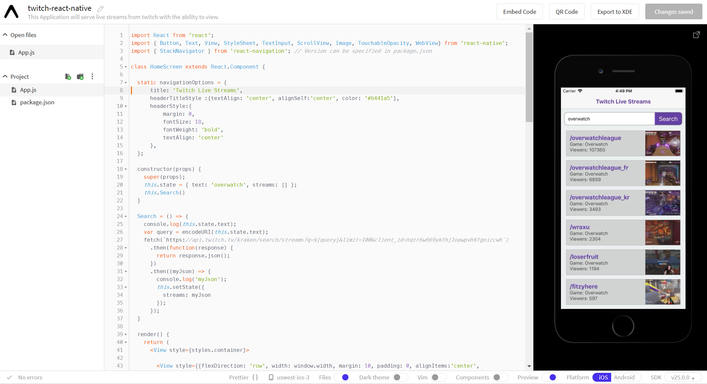
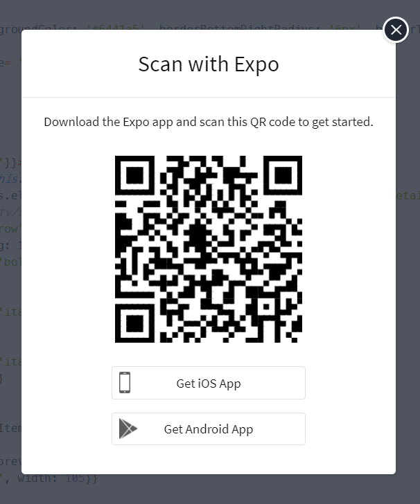

# Twitch Live Streaming App (Mobile Front End)

This Mobile Application will allow users to view Top Live Streams that are streaming on twitch.tv. This application is build using Go (Backend) and React Native (Frontend). This setup instructions covers the Frontend setup procedure. For Backend setup instructions please refer to Twitch Live Streaming App (Backend Web Server)

## User Stories
1. As a User, I want to see the Top 100 Games that are currently live. Upon selecting the game, I want to see the top 100 streams currently streaming for that game. Upon selecting the game, I want to watch the livestream in my browser.

2. As a User, I want to see the Top 100 Streams. I can then select the stream that I want to watch.


## Getting Started

These instructions will get you a copy of the project up and running on your local machine for development and testing purposes. See deployment for notes on how to deploy the project on a live system.

### Prerequisites

You will need a machine with a working internet connection and an up to date web browser.


### Installing

This application was build on [snack.expo.io](https://snack.expo.io/) and is therefore accessible via a web browser. There are two steps to run the application.

1. Open the direct link from snack.expo.io and view a live project.

  ```
  https://snack.expo.io/@danielchengml/twitch-react-native
  ```


 To view a mobile copy of the app, click on "QR Code" and follow the instructions to download "Expo" from either the AppStore or Android Market. Then, open the to scan the QR Code. You would see the application running on your mobile phone with full browsing experience. *(Please note that both your machine and mobile phone will have to be connected to the same network)*

 

2. This will require you to have the following installed on your machine:

 - An IDE ( [VS Code](https://code.visualstudio.com/?wt.mc_id=DX_841432), [Atom](https://atom.io/) or Sublime )
 - [Node.js](https://nodejs.org/en/download/)
 - [Expo](https://expo.io/) Mobile App on your iOS or Android Device
 - [create-react-native-app](http://facebook.github.io/react-native/docs/getting-started.html) using the following:

    Install `create-react-native-app`

    ```
    npm install -g create-react-native-app
    ```
    Then navigate to the folder, open it and run the following commands:
    ```
    $ cd twitch-react-native

    $ code .

    $ npm start
    ```
    Open your mobile app and scan the QR code using the Expo App on your mobile phone. You would see the application running on your mobile phone with full browsing experience. *(Please note that both your machine and mobile phone will have to be connected to the same network)*


## Deployment

Add additional notes about how to deploy this on a live system

## Built With

[Expo](https://snack.expo.io/) - The Mobile App Development Environment for Native-React Applications


## Versioning

Version 1.0.0

## Authors

**Daniel Cheng** - [danielchengml](https://github.com/daniechengml)


### Sources: Twitch API (https://dev.twitch.tv/docs/api)

- API for Top-100 Live Streams based for Selected Game: https://api.twitch.tv/kraken/search/streams?query={GAME_NAME}&limit=100&client_id={API_KEY}
